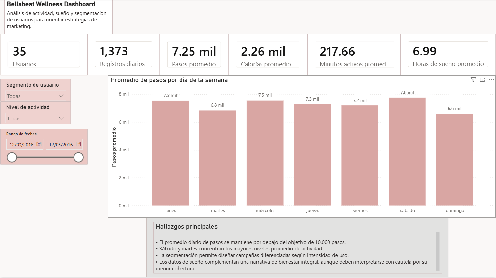

# Dashboard Power BI

Esta carpeta contiene la guía y los artefactos del dashboard final del caso Bellabeat.

## Archivos incluidos

- `guia_dashboard_powerbi.md`: instrucciones exactas para construir el dashboard en Power BI.
- `powerbi/bellabeat_dashboard.pbix`: archivo editable de Power BI.
- `powerbi/proyect/bellabeat_dashboard.pbip`: proyecto Power BI en formato PBIP.
- `exports/`: capturas PNG de las páginas finales del dashboard.

## Fuente del dashboard

Usar únicamente estos archivos procesados:

- `data/processed/bellabeat_analysis_dataset.csv`
- `data/processed/user_segments.csv`

## Páginas del dashboard

1. **Resumen ejecutivo**: KPIs de pasos, calorías, minutos activos, sueño y usuarios.
2. **Actividad**: tendencias por día de la semana, distribución de pasos y segmentos.
3. **Sueño**: horas dormidas, tiempo en cama y eficiencia.
4. **Segmentos y recomendaciones**: segmentación de usuarios y acciones de marketing.

## Evidencia exportada

Capturas finales:

- `exports/01_resumen_ejecutivo.png`
- `exports/02_actividad.png`
- `exports/03_sueno.png`
- `exports/04_segmentos_recomendaciones.png`

